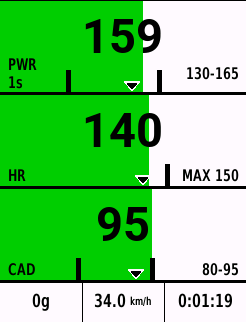
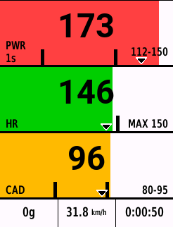
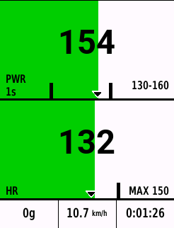
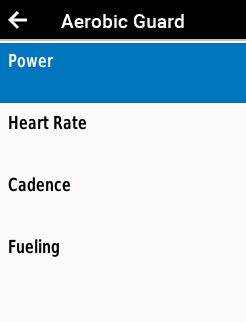
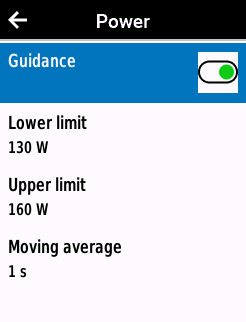

# Aerobic Guard


Aerobic Guard is a full-screen Garmin cycling data field that helps you stay
within your power, heart-rate, and cadence targets during long endurance rides.
It also keeps cumulative carbs by now, speed, and elapsed activity time on the
same page. It does not replace structured workouts or write custom FIT data.

[Install Aerobic Guard from the Connect IQ Store](https://apps.garmin.com/de-DE/apps/773419ac-8bcf-4900-9bdb-47f6affb4f6b)


## Quick start

Aerobic Guard supports Edge 540 / 540 Solar, Edge 550, Edge 840 / 840 Solar,
Edge 850, Edge 1040 / 1040 Solar, and Edge 1050, with Connect IQ 6.0.0 or
newer.

1. Install Aerobic Guard through the Connect IQ Store and sync your Edge.
2. In the cycling activity profile you use, add a data screen with a one-field
   layout and select Aerobic Guard as that field.
3. Open that data page once, then open Aerobic Guard's settings on the Edge,
   review the imported/default targets, and adjust them for your ride.
4. Start the activity normally. Aerobic Guard displays live data but does not
   start, pause, or save the activity for you.

A smaller placement displays `FULL SCREEN REQUIRED`. Configuration is
on-device; Aerobic Guard intentionally has no phone or Garmin Express settings
page. See the [user guide](docs/USER_GUIDE.md) for setup, display meaning,
settings, and troubleshooting.

## Read the display

Power and cadence bars span 0.8× the configured lower bound through 1.2× the
upper bound. Posts show the target; the fill edge is current power using the
shown 1–30 second average, or current cadence. The small outlined triangle is
Garmin's activity average. HR uses Garmin's cycling-zone minimum and maximum
and makes the configured ceiling the dominant post. Numeric values remain real
while visual positions clamp. `--` means unavailable.
Colors reinforce the range state, while posts, fill edges, and off-scale arrows
keep the same information readable without color. The bars provide range
context; they do not turn Aerobic Guard into a workout player.

The footer shows cumulative carbs by now, speed in Garmin's distance units,
and elapsed activity time. Carbs advance only after completed ten-minute blocks.

## Defaults and settings

The one-time first start may import cycling Power Zone 2 and maximum HR Zone 2.
Power may fall back to 56–75% of positive cycling FTP. Imports never overwrite
non-zero rider values or recalculate later. Cadence starts at 80–95 rpm and
carbs at 60 g/h. On-device settings cover only enablement, power bounds and
average, HR ceiling, cadence bounds, and carbohydrate rate.

## Screenshots

<table>
  <tr>
    <td align="center"><br>Steady dashboard</td>
    <td align="center"><br>Guidance boundaries</td>
    <td align="center"><br>Reduced guidance</td>
  </tr>
  <tr>
    <td align="center"><br>Settings</td>
    <td align="center"><br>Power settings</td>
    <td></td>
  </tr>
</table>

The matching store-listing descriptions are in the
[screenshot checklist](store/english.md#screenshots).

## Privacy

Aerobic Guard has no networking, accounts, advertising, analytics, location
handling, or external collection. Its only permission is User Profile for the
documented cycling zones/FTP behavior. Preferences remain on-device. See the
[privacy policy](PRIVACY.md).

## Development

```bash
./tools/check-portable
./tools/garmin doctor
./tools/check
./tools/garmin matrix
```

The graphical simulator is a human-only step. Start with the [documentation
index](docs/README.md), then see [development](docs/DEVELOPMENT.md),
[testing](docs/TESTING.md), [releasing](docs/RELEASING.md), and the
[changelog](CHANGELOG.md).

This project was developed with AI-assisted implementation and review. Product
requirements, release evidence, physical validation, signing credentials, and
publishing decisions remain human responsibilities. Generated artwork is
identified with its prompt and source under `assets/branding/`.

Licensed under the [MIT License](LICENSE). Support and source:
https://github.com/dadul96/garmin-aerobic-guard-datafield
